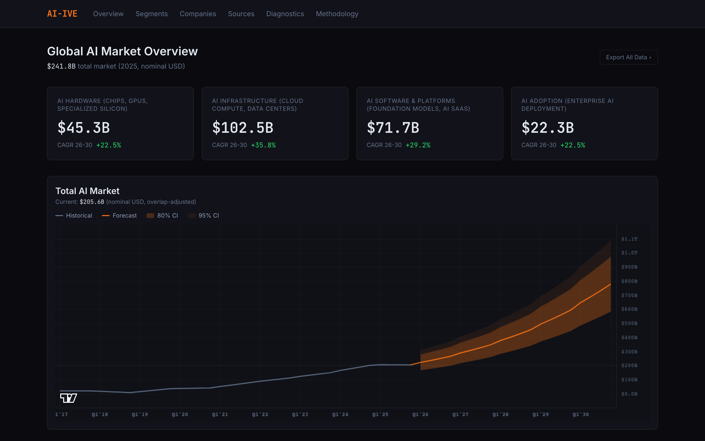
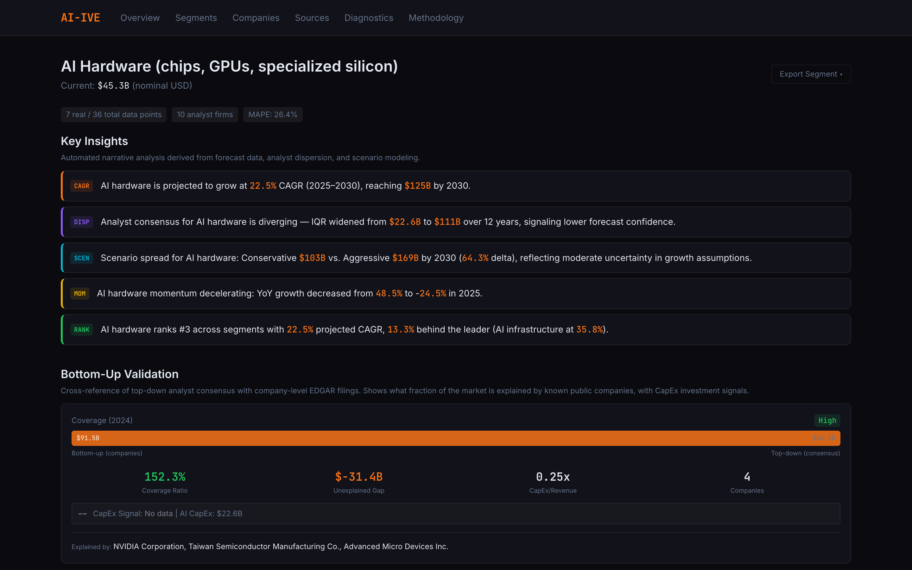
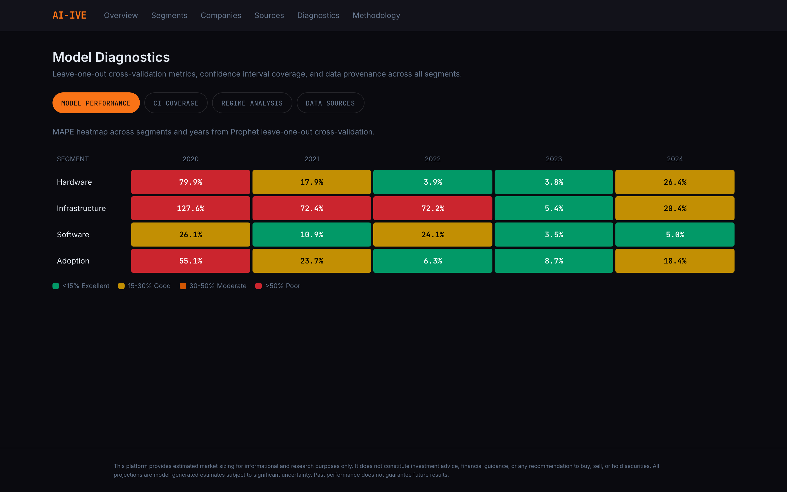
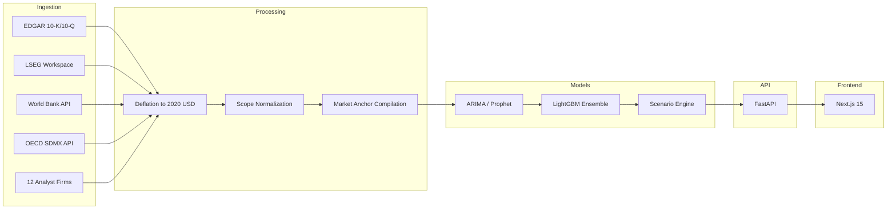

# AI Industry Value Estimator

Institutional-grade AI market sizing platform combining econometric models with analyst consensus data.






## Key Features

- **Ensemble Forecasting** -- ARIMA + Prophet + LightGBM blend with inverse-RMSE weighting and quantile confidence intervals per AI segment.
- **Analyst Dispersion Index** -- Tracks inter-quartile range across 12 analyst firms over time; converging dispersion signals rising forecast confidence.
- **Scenario Engine** -- Pre-computed Bull/Base/Bear forecast sets that run the full pipeline with distinct parameter configurations.
- **Bottom-Up Validation** -- Cross-validates top-down market estimates against firm-level revenue data from EDGAR 10-K filings and private market ARR.
- **Automated Insight Narratives** -- Rule-based generation of contextual narratives linking forecast trends to macro drivers and segment dynamics.
- **Bloomberg-Style UI** -- Dark-themed Next.js frontend with fan charts, scenario switching, dispersion visualization, and diagnostics dashboards.

## Architecture



## Quick Start

**Docker Compose (recommended):**

```bash
git clone https://github.com/amicusDei/industry-value-estimator && cd industry-value-estimator
docker compose up --build
# Frontend: http://localhost:3000 | API: http://localhost:8000
```

**Manual setup:**

```bash
uv sync
uv run python scripts/run_ensemble_pipeline.py   # Generate forecasts
cd frontend && npm install && npm run dev         # Start frontend
```

## Data Sources

| Source | Data | Coverage |
|--------|------|----------|
| [World Bank](https://data.worldbank.org) | GDP, R&D expenditure, ICT exports, patents | 16 economies, 2010--2024 |
| [OECD MSTI](https://www.oecd.org/en/data/datasets/main-science-and-technology-indicators.html) | Business R&D by sector, ICT BERD | OECD members, 2010--2024 |
| [LSEG Workspace](https://www.lseg.com/en/data-analytics/financial-data/company-data) | Revenue, R&D expense, gross margins | TRBC-classified AI companies |
| [SEC EDGAR](https://www.sec.gov/edgar) | 10-K/10-Q filings, AI revenue disclosures | 15 public companies |
| 12 Analyst Firms | Scope-normalized market size estimates | IDC, Gartner, Goldman Sachs, McKinsey, and others |

## Model Performance

Backtesting results from Prophet leave-one-out cross-validation (as of 2026-03-30):

| Segment | Prophet LOO MAPE | CI95 Coverage | Notes |
|---------|-----------------|---------------|-------|
| ai_hardware | 26.4% | 95% | NVIDIA 10-K hard actuals available |
| ai_infrastructure | 59.6% | 95% | Regime shift 2022+; post-GenAI MAPE 16.5% |
| ai_software | 13.9% | 95% | Best-performing segment |
| ai_adoption | 22.4% | 95% | Enterprise adoption proxy indicators |
| **Post-GenAI (2022+)** | **16.5%** | **95%** | **Most relevant for forward projections** |

## Tech Stack

| Layer | Technology |
|-------|-----------|
| Backend | Python 3.13, FastAPI, pandas, statsmodels, Prophet, LightGBM |
| Frontend | Next.js 15, React 19, TypeScript, TailwindCSS, lightweight-charts |
| Data | Parquet (columnar storage), pandera (schema validation) |
| Infrastructure | Docker Compose, uv (dependency management), pytest (100+ tests) |

## License

MIT License. See [LICENSE](LICENSE) for details.

**Disclaimer:** This project is an independent research tool. Market size estimates are model-derived and should not be used as the sole basis for investment decisions. All data sources are cited; no proprietary data is redistributed.
