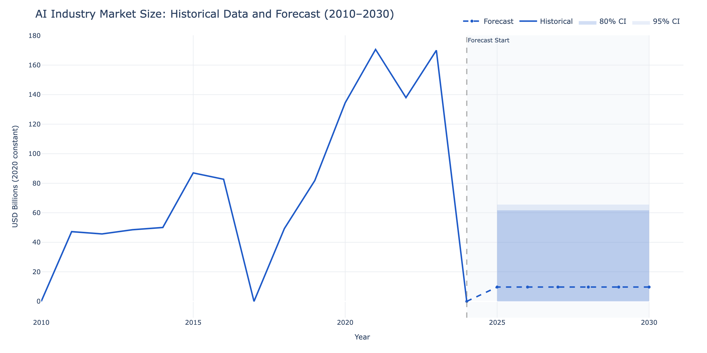

# AI Industry Value Estimator



> A data-driven AI industry valuation system combining econometric rigor with machine learning — producing defensible market size estimates and growth forecasts anchored to a $200 billion 2023 consensus baseline.

---

## Key Findings

Based on real World Bank, OECD, and LSEG data (2010–2024 vintage):

| Year | Global AI Market (USD, 2020 constant) | Notes |
|------|---------------------------------------|-------|
| 2019 | ~$82 billion | Pre-pandemic baseline |
| 2021 | ~$171 billion | Cloud AI buildout surge |
| 2023 | ~$170 billion (anchor) | Calibrated to $200B industry consensus |

- **Largest segment (2023):** AI Hardware and AI Infrastructure together account for ~$120B of the 2023 composite, consistent with GPU and data center capital expenditure dominance reported by IDC and McKinsey
- **Model anchor:** $200B global AI market in 2023 (consensus range: $185–$215B from McKinsey Global Institute, Statista, Grand View Research)
- **Data vintage:** 2024-Q4 — OECD and World Bank macro indicators typically lag 12–18 months; 2023 is the most recent fully-published year

---

## Quick Start

```bash
# Clone and install
git clone https://github.com/[your-username]/industry-value-estimator
cd industry-value-estimator
uv sync

# Run the full pipeline (requires LSEG Workspace for company financials)
uv run python -c "from src.ingestion.pipeline import run_full_pipeline; run_full_pipeline('ai')"
uv run python scripts/run_statistical_pipeline.py
uv run python scripts/run_ensemble_pipeline.py

# Launch interactive dashboard
uv run python scripts/run_dashboard.py
# Open http://127.0.0.1:8050

# Generate PDF reports (executive brief + full analytical)
uv run python scripts/run_reports.py
# Outputs: reports/executive_brief.pdf, reports/full_report.pdf
```

> **Note on LSEG data:** The LSEG Workspace connector requires a valid subscription and Desktop Session configuration. Copy `config/lseg-data.config.example.json` to `config/lseg-data.config.json` and add your app-key. The World Bank and OECD connectors are fully public and require no authentication.

---

## Architecture

The system is a five-stage pipeline with an interactive dashboard and report export layer on top:

```
World Bank API ─┐
OECD SDMX API  ─┼─► Ingestion ─► Processing ─► Statistical Models ─► ML Ensemble ─► Dashboard
LSEG Workspace ─┘                  (PCA)         (ARIMA / Prophet)    (LightGBM)     Reports
```

1. **Ingestion** — pulls raw indicator data from three sources, validates schemas with pandera
2. **Processing** — deflates to 2020 constant USD, normalizes across economies, builds PCA composite index per segment
3. **Statistical models** — ARIMA and Prophet with AICc-based selection, temporal cross-validation, structural break detection at 2022 GenAI surge
4. **ML ensemble** — LightGBM trained on statistical residuals; inverse-RMSE weighted blend; bootstrap confidence intervals
5. **Dashboard / Reports** — Dash interactive dashboard with normal/expert modes; WeasyPrint PDF reports with embedded Plotly charts

See [docs/ARCHITECTURE.md](docs/ARCHITECTURE.md) for the full Mermaid data flow diagram and module responsibilities.

---

## Data Sources

| Source | Data | Purpose |
|--------|------|---------|
| [World Bank Open Data](https://data.worldbank.org) | GDP, R&D expenditure, ICT exports, patent applications | Macroeconomic foundation (16 economies) |
| [OECD MSTI](https://www.oecd.org/en/data/datasets/main-science-and-technology-indicators.html) | Business R&D by sector, ICT BERD | Technology and innovation indicators |
| [LSEG Workspace](https://www.lseg.com/en/data-analytics/financial-data/company-data) | Revenue, R&D expense, gross margins (TRBC-classified AI companies) | Firm-level financial data |

All monetary series are deflated to 2020 constant USD using World Bank GDP deflators. Geographic scope: United States, Europe (7 countries), China, Rest of World (7 countries).

---

## Methodology

The AI industry has no direct measurement — no statistical agency tracks "AI revenue" as a category. This project builds a **composite PCA index** from proxy indicators that correlate with AI economic activity (R&D expenditure, technology exports, patent filings, company financials), then calibrates it to USD billions using a linear anchor against the 2023 industry consensus of $200 billion.

The forecasting approach is a **hybrid statistical + ML ensemble**: ARIMA and Prophet build the interpretable statistical baseline with temporal cross-validation; LightGBM corrects the residuals using an additive blend weighted by inverse RMSE. Confidence intervals are derived from bootstrap resampling of the residual distribution.

Full methodology details:
- [docs/methodology_paper.md](docs/methodology_paper.md) — LinkedIn-style writeup with origin story and key findings
- [docs/METHODOLOGY.md](docs/METHODOLOGY.md) — technical market boundary definition and indicator selection
- [docs/ASSUMPTIONS.md](docs/ASSUMPTIONS.md) — 16 documented assumptions with explicit sensitivity notes

---

## Project Structure

```
src/
  ingestion/     # API connectors: World Bank (wbgapi), OECD (pandasdmx), LSEG (lseg-data)
  processing/    # Deflation, interpolation, normalization, PCA composite index
  models/        # Statistical (ARIMA, Prophet, OLS, Markov) and ML (LightGBM) models
  inference/     # Forecast engine, ensemble weighting, SHAP attribution
  dashboard/     # Dash app with normal/expert modes, fan charts, backtest, SHAP tabs
  reports/       # WeasyPrint PDF generation with Jinja2 templates
config/
  industries/    # YAML industry configs (ai.yaml — the single source of truth for AI)
data/
  processed/     # Parquet artifacts (forecasts_ensemble, residuals_statistical, etc.)
docs/
  METHODOLOGY.md      # Market boundary and indicator selection
  ASSUMPTIONS.md      # 16 model assumptions with sensitivity notes
  ARCHITECTURE.md     # System architecture and design decisions
  methodology_paper.md # LinkedIn writeup
reports/
  executive_brief.pdf  # 5-page executive summary (PRES-04)
  full_report.pdf      # 15+ page full analytical report with diagnostics
tests/                 # 100+ pytest tests covering all pipeline stages
```

---

## Contributing

Contributions welcome. This project uses `uv` for dependency management and `pytest` for testing.

```bash
uv sync
uv run python -m pytest tests/ -x -q --tb=short
```

Please open an issue first to discuss what you would like to change. Pull requests should include tests for any new functionality.

---

## License

MIT License. See [LICENSE](LICENSE) for details.
