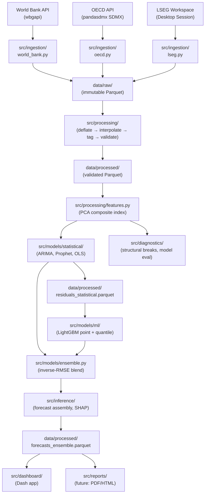

# Architecture Guide

*AI Industry Value Estimator — System Architecture*

---

## Overview

The AI Industry Value Estimator is a bottom-up data pipeline that produces defensible,
data-driven valuations and growth forecasts for the global AI industry. The system
ingests macro-economic and company-level data from three public sources, transforms it
into a comparable composite index, fits statistical and ML models per AI segment, and
surfaces the results in an interactive Dash dashboard with calibrated confidence intervals.

The pipeline is industry-agnostic by design (ARCH-01): all source, indicator, and segment
definitions live in `config/industries/*.yaml`. Adding a new industry requires only a new
YAML file — no code changes.

---

## Data Flow Diagram

---

## Module Responsibilities

| Package | Responsibility |
|---------|---------------|
| `src/ingestion/` | Fetch raw data from external APIs; validate immediately with pandera schemas; write to `data/raw/` as immutable Parquet with provenance metadata |
| `src/processing/` | Deflate nominal monetary series to 2020 constant USD; interpolate gaps with transparency flagging; apply industry/segment tags; validate against PROCESSED_SCHEMA |
| `src/models/statistical/` | Fit ARIMA(p,d,q) and Prophet models per AI segment; run expanding-window temporal CV; export residuals for ML training |
| `src/models/ml/` | Train LightGBM on statistical residuals for systematic bias correction; fit quantile models for 80%/95% CI bounds |
| `src/models/ensemble.py` | Combine statistical baseline with LightGBM residual correction via inverse-RMSE weighting (additive blend) |
| `src/diagnostics/` | Structural break detection (CUSUM, Chow, Markov switching); model evaluation metrics (RMSE, MAPE, AICc); ARIMA vs. Prophet comparison |
| `src/inference/` | Assemble forecast DataFrame with dual units (real 2020 USD + nominal USD), vintage column, and monotonically clipped CI bounds; SHAP feature attribution |
| `src/dashboard/` | Dash interactive dashboard — Overview, Segments, Drivers, and Diagnostics tabs; Normal/Expert mode content distinction |
| `config/industries/` | Single source of truth for indicator codes, TRBC sector codes, segment definitions, and value chain multipliers |

---

## Key Design Decisions

- **Config-driven extensibility (ARCH-01):** All data source indicators, TRBC codes, date ranges, and segment definitions live in `config/industries/*.yaml`. Adding a new industry requires only a new YAML file. No hardcoded indicator codes anywhere in `src/`.

- **Parquet as interchange format:** All intermediate data (raw, processed, residuals, forecasts) is stored as Snappy-compressed Parquet with embedded provenance metadata (source, industry, fetch timestamp, base year). Parquet enables typed columnar reads, schema evolution, and fast IO for the ~15-year × 4-segment panels in this project.

- **PCA composite index for multi-indicator fusion:** AI market activity has no single clean observable metric. Six proxy indicators (R&D spend, AI patents, VC investment, company revenue, researcher density, high-tech exports) are combined into the first principal component of PCA. This is data-driven, reproducible, and avoids arbitrary manual weighting. The PCA pipeline is fit on training data only to prevent temporal leakage.

- **Additive ensemble blend (stat + ML correction):** The LightGBM model is trained on statistical model residuals, not on raw target values. It produces a residual correction term, not an independent full forecast. The ensemble formula is `stat_pred + lgbm_weight × correction`, which is additive rather than a convex combination. This preserves the statistical baseline's interpretability while leveraging ML to correct systematic biases.

- **Value chain multiplier for index-to-USD conversion:** The PCA composite index is dimensionless (centered at zero). A per-segment multiplier anchored to the ~$200B 2023 global AI market consensus (McKinsey, Statista, Grand View Research) converts index scores to USD billions for dashboard display. The multiplier is calibrated at app startup from `config/industries/ai.yaml § value_chain`.

- **Normal/Expert mode content distinction:** The dashboard serves two audiences. Normal mode shows USD estimates and plain-language narrative. Expert mode exposes raw composite index values, multiplier derivation tables, CV metrics, and `docs/ASSUMPTIONS.md` cross-references. This distinction avoids overwhelming non-technical users while keeping the methodology fully transparent.

- **Structural break at 2022 explicitly modeled:** The ChatGPT/GenAI launch in late 2022 created a structural break in AI market dynamics. Prophet receives an explicit `changepoints=["2022-01-01"]` anchor. ARIMA detects higher differencing order where needed. CUSUM and Chow tests confirm the break in diagnostic outputs.

---

## Where to Start

For a new reader, suggested reading order:

1. `config/industries/ai.yaml` — understand the data model (segments, indicators, TRBC codes)
2. `src/ingestion/pipeline.py` — see how the config drives the ingestion orchestration
3. `src/processing/features.py` — understand PCA composite index construction and leakage prevention
4. `src/models/ensemble.py` — understand the additive blend combining statistical and ML layers
5. `src/dashboard/app.py` — see value chain multiplier calibration and data loading at startup

Then read `docs/ASSUMPTIONS.md` for the full list of modeling assumptions, sensitivity notes, and what-if analysis.
